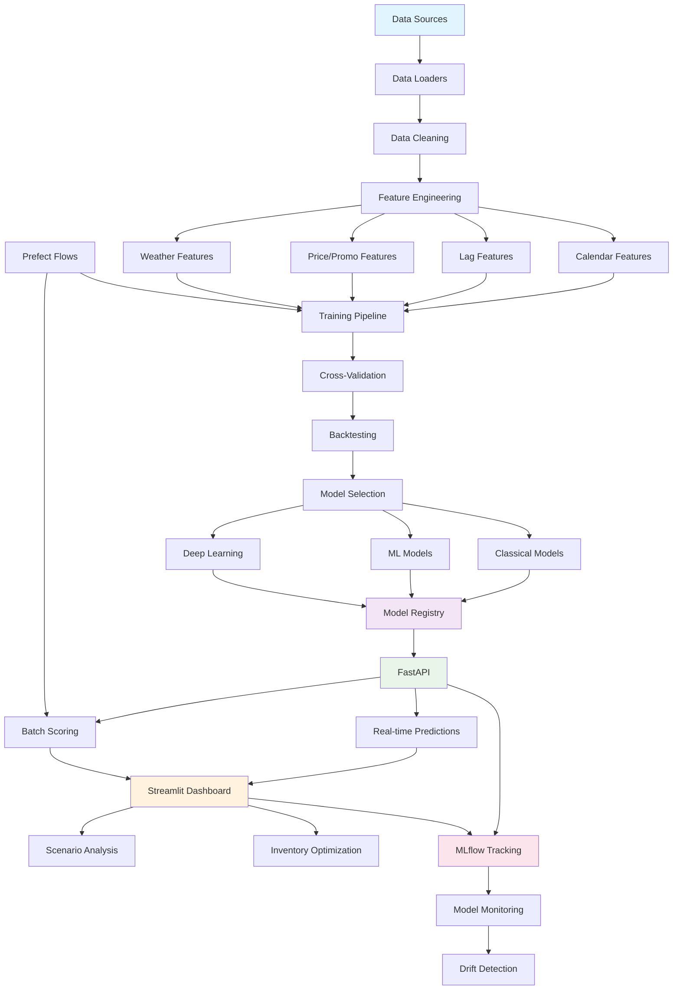

# ForecastIt

Intelligent demand & sales forecasting system with cleaning pipelines, feature engineering, multiple model families (classical/ML/DL), time-series CV & backtesting, explainability, uncertainty quantification, API, dashboard, and orchestration.

[](https://github.com/your-org/forecastit/actions)
[](https://codecov.io/gh/your-org/forecastit)
[](https://www.python.org/downloads/release/python-3110/)
[](https://opensource.org/licenses/MIT)

## Features

- **End-to-end Pipeline**: Data loading, Cleaning, Feature Engineering, Training & Inference
- **Multiple Model Families**: Classical (SARIMAX, Prophet), ML (LightGBM, XGBoost), DL (LSTM)
- **Time-Series Aware**: Proper CV, backtesting, and no data leakage
- **Uncertainty Quantification**: Confidence intervals and quantile predictions
- **Explainability**: SHAP values, feature importance, and model diagnostics
- **Business Intelligence**: Inventory optimization (ROP, Safety Stock)

### Production Ready

- **FastAPI**: High-performance inference API with automatic documentation
- **Streamlit Dashboard**: Interactive business user interface
- **Docker**: Containerized deployment with docker-compose
- **MLflow**: Model registry, experiment tracking, and deployment
- **Prefect**: Workflow orchestration and scheduling
- **CI/CD**: GitHub Actions with comprehensive testing

## Architecture



### System Components

| Component          | Technology                      | Purpose                             |
| ------------------ | ------------------------------- | ----------------------------------- |
| **Data Pipeline**  | Pandas, Polars                  | Data loading, cleaning, validation  |
| **Feature Store**  | Custom modules                  | Calendar, lag, price/promo features |
| **Model Training** | Scikit-learn, LightGBM, XGBoost | Multiple model families with CV     |
| **Model Registry** | MLflow                          | Versioning, staging, deployment     |
| **API**            | FastAPI                         | High-performance inference          |
| **Dashboard**      | Streamlit                       | Business user interface             |
| **Orchestration**  | Prefect                         | Workflow management                 |
| **Monitoring**     | MLflow, Structlog               | Experiment tracking, logging        |

## Quick Start

### Prerequisites

- Python 3.11+
- Poetry
- Docker & Docker Compose (optional)

### Installation

```bash
# Clone the repository
git clone https://github.com/your-org/forecastit.git
cd forecastit

# Install dependencies
make install

# Generate synthetic data
make generate-synth

# Train models
make train

# Start API server
make serve-api

# Start dashboard (in another terminal)
make serve-app
```

### Docker Deployment

```bash
# Build and start all services
docker-compose up --build

# Access the services
# API: http://localhost:8000
# Dashboard: http://localhost:8501
# MLflow: http://localhost:5000
```

## Data Schema

### Raw Data Format

```csv
date,store_id,item_id,sales,on_promo,price,temperature,precipitation,holiday_name
2023-01-01,store_01,item_001,150.5,0,12.99,20.5,0.0,New Year's Day
2023-01-02,store_01,item_001,145.2,0,12.99,22.1,0.0,
```

### Feature Engineering

- **Calendar**: Day of week, month, quarter, holidays, seasonality
- **Lags**: Sales lag 1, 7, 14, 28 days
- **Rolling**: 7/14/28-day means, std, min, max
- **Price/Promo**: Elasticity, effectiveness, frequency
- **Weather**: Temperature, precipitation with lag features

## Model Families

### 1. Classical Models

- **SARIMAX**: Seasonal ARIMA with external regressors
- **Prophet**: Facebook's time series forecasting
- **Seasonal Naive**: Baseline for comparison

### 2. Machine Learning

- **LightGBM**: Gradient boosting with quantile regression
- **XGBoost**: Extreme gradient boosting
- **Feature Engineering**: Calendar, lags, rolling statistics

### 3. Deep Learning

- **LSTM**: Long Short-Term Memory networks
- **Sequence Modeling**: Windowed time series data

## API Documentation

### Endpoints

#### Health Check

```bash
GET /health
```

#### Generate Forecasts

```bash
POST /predict
Content-Type: application/json

{
  "store_id": "store_01",
  "item_id": "item_001",
  "start_date": "2024-01-01",
  "end_date": "2024-01-28",
  "promo_plan": [0, 1, 0, 1, 0, 0, 0],
  "price_plan": [12.99, 9.99, 12.99, 9.99, 12.99, 12.99, 12.99]
}
```

#### Inventory Optimization

```bash
POST /inventory/suggest
Content-Type: application/json

{
  "store_id": "store_01",
  "item_id": "item_001",
  "service_level": 0.95,
  "lead_time": 7,
  "holding_cost": 0.1,
  "stockout_cost": 10.0
}
```

#### Model Explanation

```bash
GET /explain/{store_id}/{item_id}
```

## Business Impact

### Key Metrics

- **Forecast Accuracy**: RMSE, MAPE, sMAPE improvements
- **Inventory Optimization**: Reduced stockouts, lower carrying costs
- **Promotion Planning**: Data-driven promotion strategies
- **Scenario Analysis**: What-if analysis for business decisions

### ROI Calculation

```
Inventory Savings = (Reduced Safety Stock × Holding Cost) + (Reduced Stockouts × Stockout Cost)
Forecast Accuracy = (Previous RMSE - New RMSE) / Previous RMSE × 100%
```

## Testing

```bash
# Run all tests
make test

# Run with coverage
make cov

# Run specific test categories
make test-fast          # Skip slow tests
make test-integration   # Integration tests only
```

## Development

### Code Quality

```bash
# Linting
make lint

# Formatting
make format

# Type checking
make typecheck

# Pre-commit hooks
make pre-commit-install
```
